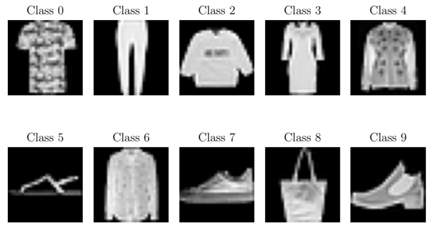
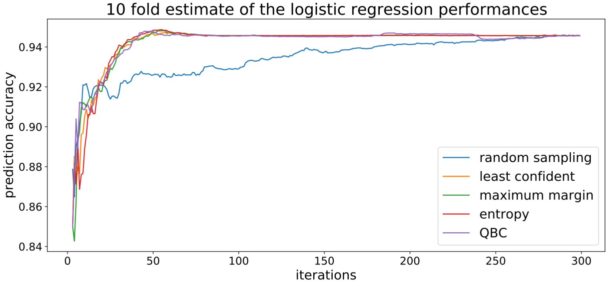

The Fashion-MNIST data-set is used in this project. It is a collection of Zalando’s article images consisting of 60.000 training points and 10.000 test points. The data-set is balanced perfectly so that each class has 6.000 training and 1.000 test points. Each data-point resembles a grey-scale image of size 28x28 pixels, with a label indicating which class it belongs to (a total of 10 classes).

We used this dataset as it is sufficiently simple but still complicated enough that a model won't get 100% accuracy

Different uncertainy sampling strategies

Least confident

$$
    x^{\ast} = \argmax_{x \in U} 1 − p_{\theta} \left( y_{(1)}|x \right)
$$
maximum margin
$$
    x^{\ast} = \argmax_{x \in U} p_{\theta} \left( y_{(1)}|x \right) − p_{\theta} \left( y_{(2)}|x \right)
$$
entropy
$$
    x^{\ast} = \argmax_{x \in U} -\sum_{y-\in Y} p_{\theta} \left( y|x \right) \log p_\theta (y|x)
$$

