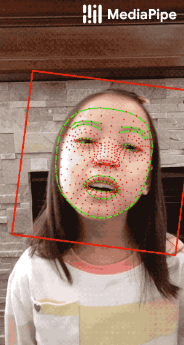



Use the excellent [MediaPipe framework](https://chuoling.github.io/mediapipe/solutions/face_mesh.html) to find faces in videos. The video below shows how excellent this library is at finding the face.


