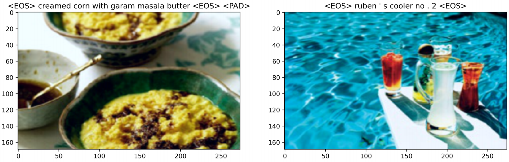
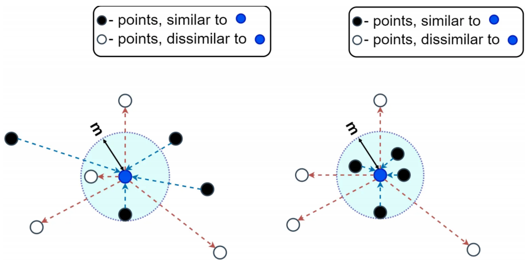
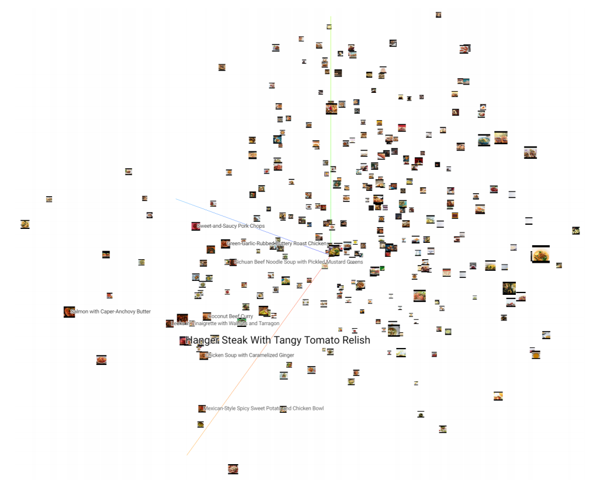
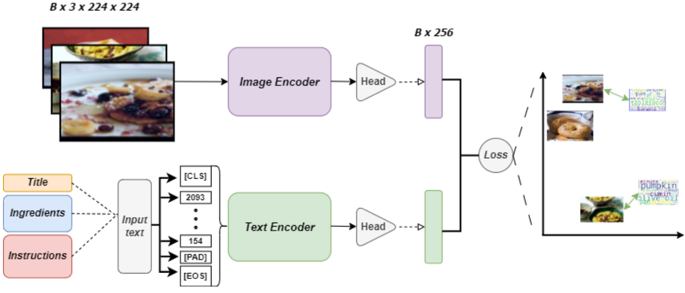
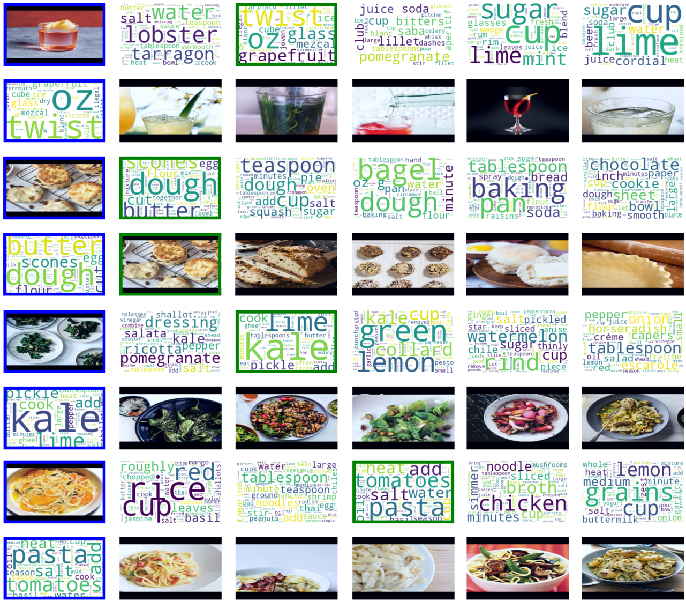
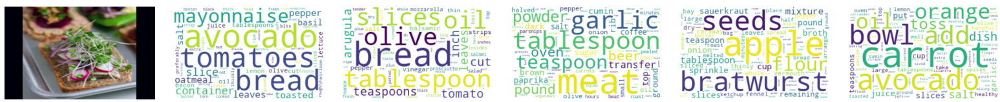

# Motivation

I realised midways during this project that we had essentially just recreated the CLIP model.

# Data

## Contrastive learning

### Math

$$
    L_{bi} (a^{n=i}, b^{n=i}, b^{b\neq i}, a^{n\neq i}) = \frac{1}{B} \sum_{j=1}^B L^\prime_{bi}(i,j)\delta(i,j)
$$

 

# Model

# Results
We can go both forwards and backwards between images and text.

## Out of distribution image

