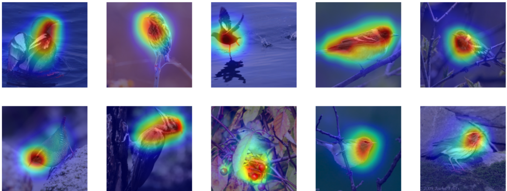
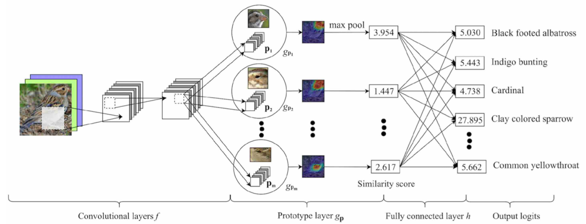
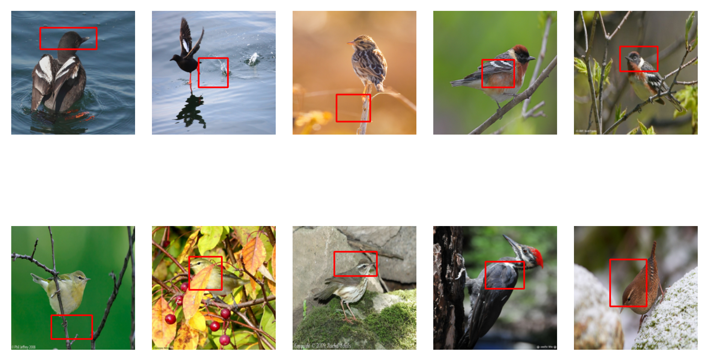

Class Activation mappings (CAM) based on the output of a simple ResNet18 model

Prototype based network. Works on a this-looks-like-that principle, i.e. it looks in other images with similar features to explain why it classifies image to certain classes.

